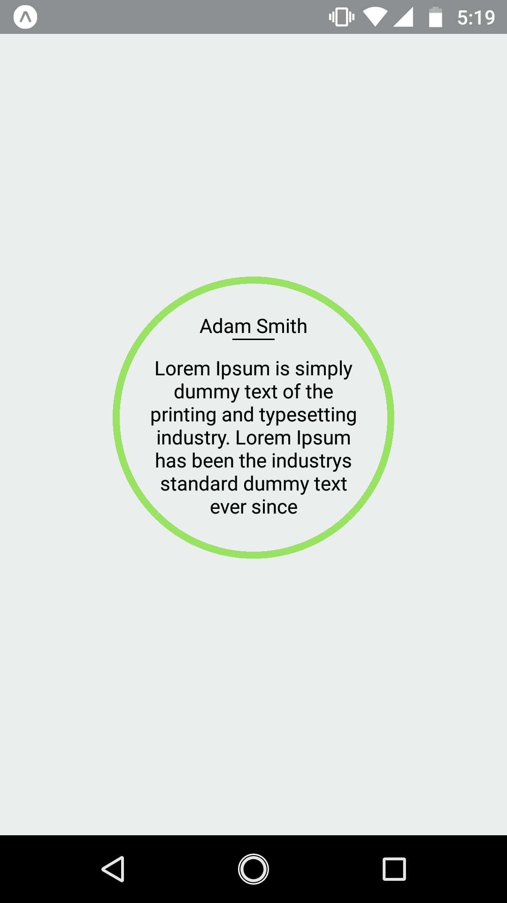

## Run locally
Type this command on your terminal:

### `https://github.com/nirajradadiya/react-native-demo.git`
### `cd react-native-demo`
### `npm install`
#### `npm run ios`

Like `npm start`, but also attempts to open your app in the iOS Simulator if you're on a Mac and have it installed.

#### `npm run android`

Like `npm start`, but also attempts to open your app on a connected Android device or emulator.

